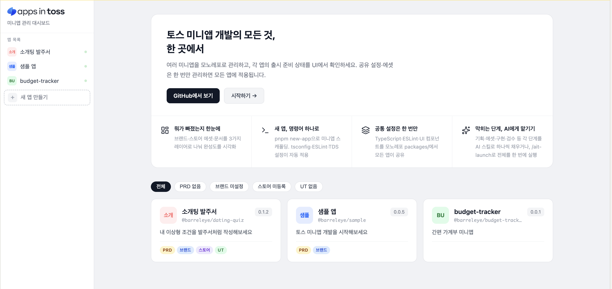

# Create Apps in Toss


**토스 미니앱 개발의 모든 것, 한 곳에서.**

여러 미니앱을 모노레포로 관리하고, 각 앱의 출시 준비 상태를 대시보드 UI로 확인하세요.
공통 설정은 한 번만, 막히는 단계는 AI에게 맡기세요.



**[→ 데모 보기](https://awesome-apps-in-toss.github.io/create-apps-in-toss/)**


---

## 이게 뭔가요?

토스 미니앱(앱인토스)을 만들다 보면 이런 상황이 생깁니다.

> "PRD는 만들었나? 스토어 등록용 로고는? 앱 이름 영어로 뭐라고 했더라?"

앱이 여러 개가 되면 각 앱의 상태를 파악하는 것 자체가 일이 됩니다.
Barreleye는 이 문제를 해결하는 **미니앱 전용 개발 허브**입니다.

---

## 주요 기능

### 📊 뭐가 빠졌는지 한눈에
브랜드 설정, 스토어 에셋, 기획 문서를 3가지 레이어로 나눠 각 앱의 완성도를 시각화합니다. 어느 앱이 출시에 얼마나 가까운지 카드 하나로 파악됩니다.

### ⚡ 새 앱, 명령어 하나로
```bash
pnpm new-app my-app
```
TypeScript·ESLint·TDS 설정이 자동으로 적용된 미니앱이 생성됩니다. 스캐폴딩부터 개발까지 바로 시작할 수 있습니다.

### 📦 공통 설정은 한 번만
`packages/`에 TypeScript 설정·ESLint 규칙·UI 컴포넌트를 모아두면 모든 앱이 공유합니다. 설정을 고칠 때 파일 하나만 수정하면 됩니다. 템플릿이 제공하는 대시보드는 `internal/dashboard/`에 있어 사용자 코드(`apps/`, `packages/`)와 섞이지 않습니다.

### 🤖 막히는 단계, AI에게 맡기기
기획·에셋·구현·검수 등 각 단계를 AI 스킬로 하나씩 채우거나, `/ait-launch`로 7단계 전체를 한 번에 실행할 수 있습니다.

```
기획 → 에셋 → 스캐폴딩 → TDS → 구현 → 검수 → 빌드
```

---

## 빠른 시작

```bash
# 1. 스캐폴드 (권장)
npx create-apps-in-toss my-miniapp
cd my-miniapp

# 또는 포크/클론으로 템플릿 자체를 개발하려면:
# git clone https://github.com/Awesome-Apps-in-Toss/create-apps-in-toss.git
# cd create-apps-in-toss

# 2. 의존성 설치
pnpm install

# 3. 대시보드 실행
pnpm dev
```

브라우저에서 `http://localhost:3000` 열면 대시보드가 뜹니다.

### 새 미니앱 추가

```bash
pnpm new-app my-app
pnpm install
pnpm --filter @barreleye/my-app dev
```

---

## 프로젝트 구조

```
barreleye/
├── apps/                # 사용자 미니앱 (신규 생성/추가)
├── packages/            # 사용자 공용 패키지
│   ├── tsconfig/        # 공유 TypeScript 설정
│   ├── eslint-config/   # 공유 ESLint 설정
│   └── ui/              # 공유 UI 컴포넌트
├── internal/            # 템플릿 관리 영역 (update-template 동기화)
│   ├── dashboard/       # 관리 대시보드
│   └── create-apps-in-toss/  # 스캐폴더 (npx 배포용, fork 전용)
├── docs/                # 가이드 문서
└── scripts/             # 유틸리티 스크립트
```

---

## 기술 스택

| 영역 | 기술 |
|------|------|
| 런타임 | React 18, TypeScript 5.6 |
| 빌드 | Vite 6, Turborepo |
| 모노레포 | pnpm workspaces |
| 상태 관리 | TanStack Query v5 |
| 라우팅 | React Router v7 |
| 앱인토스 SDK | `@apps-in-toss/web-framework` ^2.x |
| 디자인 시스템 | `@toss/tds-mobile` ^2.x |

---

## 주요 명령어

| 명령어 | 설명 |
|--------|------|
| `pnpm dev` | 대시보드 개발 서버 실행 |
| `pnpm build` | 전체 빌드 |
| `pnpm new-app <name>` | 새 미니앱 생성 |
| `pnpm update-template` | 원본 템플릿(스킬·스크립트·대시보드)을 최신 버전으로 동기화 |
| `pnpm lint` | 전체 린트 검사 |
| `pnpm typecheck` | 전체 타입 체크 |

---

## 템플릿 업데이트 받기

클론한 뒤에도 원본 레포의 스킬·스크립트·대시보드 개선사항을 계속 받아올 수 있습니다. `apps/*`(당신이 만든 앱)는 건드리지 않고 템플릿 영역만 동기화됩니다.

```bash
pnpm update-template
```

자세한 내용은 [docs/guides/update-template.md](docs/guides/update-template.md)를 참고하세요.

---

## 참고

- 앱인토스 개발자 문서: [developers-apps-in-toss.toss.im](https://developers-apps-in-toss.toss.im)
- SDK 2.x 필수 (2026년 3월 23일 이후 1.x 업로드 불가)
- 비게임 미니앱은 `@toss/tds-mobile` 컴포넌트 사용 필수
